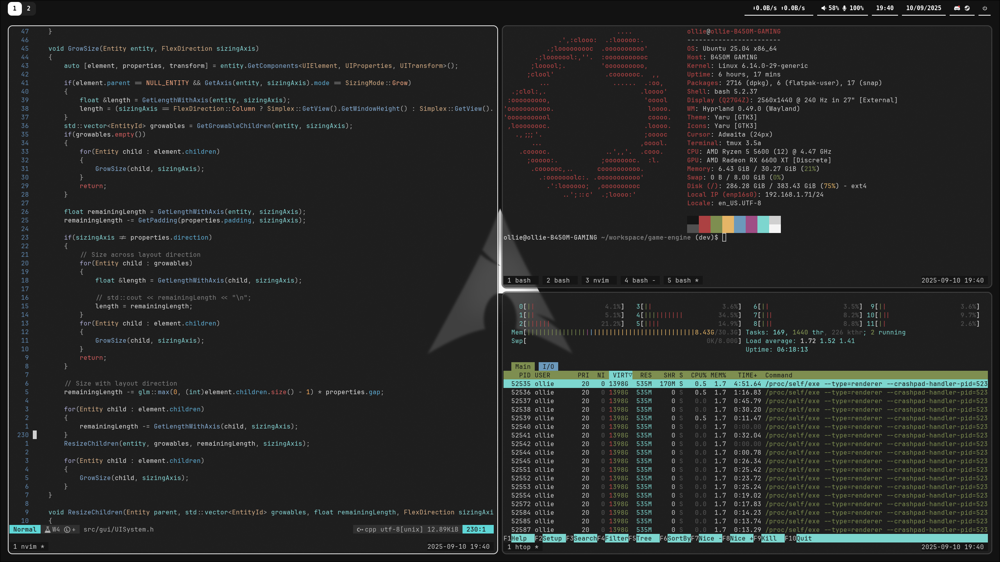

<div align=center>
  <h1>【My Hyprland dotfiles 】</h1>
  
</p>
</div>
<div align=center>
  


</div>
<div align=center>
  <h2>- Overview -</h2>
</div>
<p>A curated Hyprland configuration featuring Hyprland, Waybar, Wofi, wlogout, Neovim, WezTerm, and custom wallpaper scripts.</p>


<div align=center>
  <h2>- Preview -</h2>

  
</div>

<div align=center>
  <h2>- Installation -</h2>
</div>

Enter the commands below in the ```$HOME``` directory, and reboot afterwards.
```bash
git clone https://github.com/Ollie-Moss/dotfiles
mv -n .config/* dotfiles
rm -d .config
mv dotfiles .config
```


<div align=center>
  <h2>- Features -</h2>
</div>

- **hypr/** – Your Hyprland configuration files  
- **waybar/** – Waybar status bar setup  
- **wofi/** – Application launcher (Wofi) configuration  
- **wlogout/** – Logout/lock screen styling  
- **nvim/** – Neovim setup (Lua, plugins)  
- **wallpapers/** – Wallpaper selector and Pywal integration  
- **.bashrc**, **.tmux.conf**, **.wezterm.lua** – Shell, terminal multiplexer, and WezTerm customizations


<div align=center>
  <h2>- License -</h2>
</div>
There is no license set for this repository.
